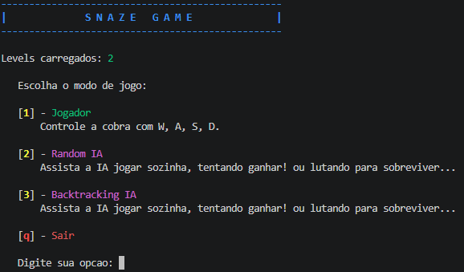
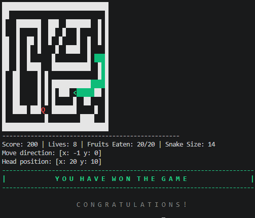

[](https://classroom.github.com/a/FGd7MFW2)

# Projeto Snaze

A reinterpretation of the classic Snake game in C++, with a focus on state machines and AI/player controllers.


[]()
[]()

---

## About

Snaze is an educational implementation of the Snake game that emphasizes the use of finite state machines and different controllers (AI and player). The program drives the snake through a maze to reach food, validating input files and exposing simulation states.

The full project specification is available in `docs/snake_programming_project.pdf`.

---

## Features

- Snake simulation in a maze environment.
- Player controller mode (user input).
- AI controller mode guiding the snake toward the food.
- Input file validation (format and integrity).
- Well-defined simulation states (initialization, running, paused, game over).
- Extra features slot (e.g., shortest-path search).

---

## Requirements

- C++ compiler with C++17 support (g++, clang++, MSVC).
- CMake >= 3.5
- Make, Ninja, or another CMake-compatible generator.
- Linux, macOS, or Windows (paths/commands may vary).

---

## How to compile and run (Build)

With CMake flow:

```bash
# from the project root
cmake -S . -B build
cmake --build build

./build/snaze --help
#Use --help only if you do not know the commands. 
```
&copy; DIMAp/UFRN 2021-2025.
